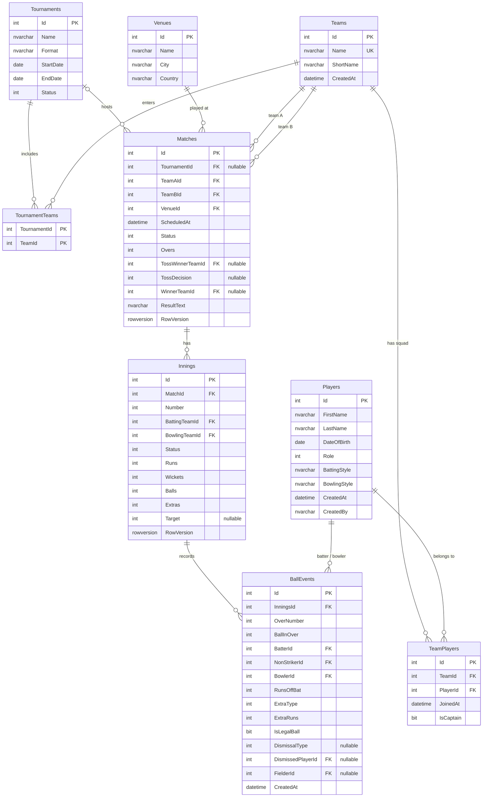

# CricScore: ERD (draft)

Draft for Day 1. Columns are finalised on Day 4. Identity tables (Users, Roles, UserRoles) come from ASP.NET Core Identity and are not drawn here.

## Constraints and indexes to add on Day 4

- Unique: `Teams.Name`, `TeamPlayers (TeamId, PlayerId)`, `Innings (MatchId, Number)`, `BallEvents (InningsId, OverNumber, BallInOver, sequence)`.
- Check: `Matches.TeamAId <> TeamBId`, `Matches.Overs > 0`.
- Indexes: all foreign keys, `Matches (Status, ScheduledAt)`.
- Batting and bowling figures are derived from `BallEvents`; there are no separate score tables.
